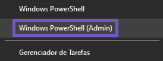
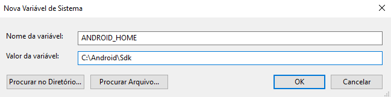
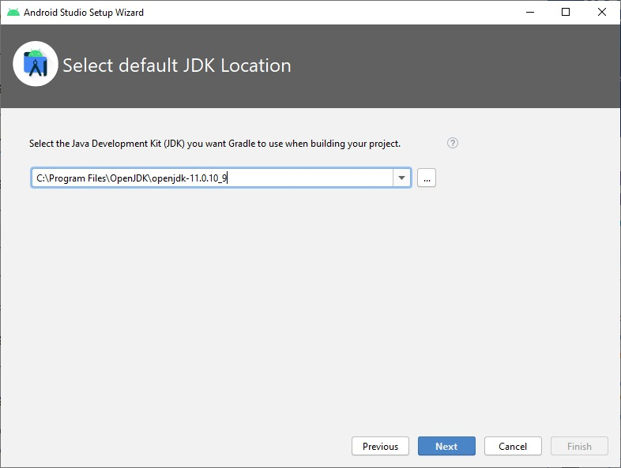
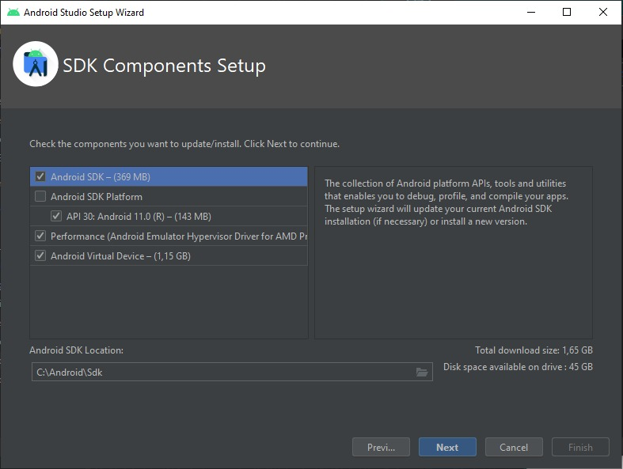
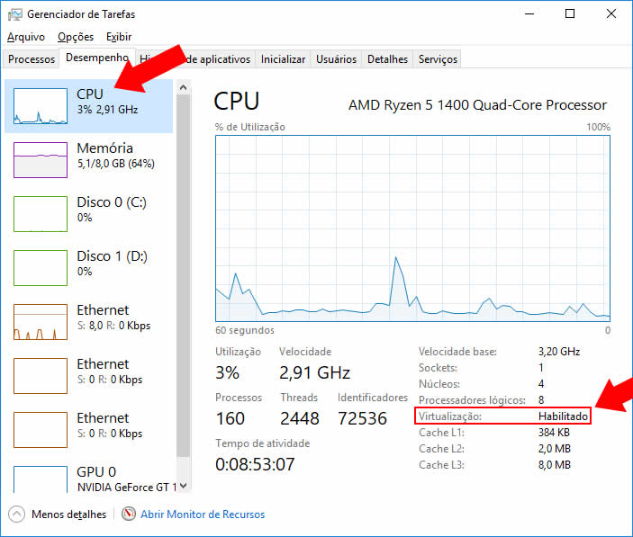
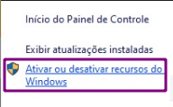
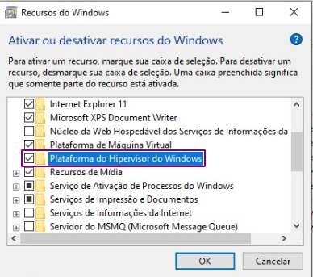

# Windows

-   Dependências

    -   Para configurar o ambiente Android no Windows, iremos realizar 5 instalações principais:

        -   Chocolatey
        -   Node.js 14 (LTS)
        -   Yarn 1
        -   JDK 11 (LTS)
        -   Android Studio e dependências.

    > Nota: Não será realizada a instalação global do react-native-cli pois ela tem causado erros. Para criar e executar nossos projetos React Native, utilizaremos os comandos via npx

-   Instalando Chocolatey

    -   Para instalar as libs no Windows, vamos utilizar um gerenciador de pacotes do Windows chamado Chocolatey. Esse gerenciador nos possibilita instalar dependências e ferramentas no sistema com poucos comandos e tudo pelo terminal. Execute o powershell como administrador utilizando a tecla Windows + X ou clicando com o botão direito sobre o botão “Iniciar”:

        

    -   Execute o comando abaixo para verificar se você possui permissões para instalar dependências com o terminal:

    ```
    Get-ExecutionPolicy
    ```

    -   Caso o retorno desse comando seja diferente de “Restricted”, pule para o próximo passo. Porém, se o retorno for “Restricted”, execute o seguinte comando em seu terminal:

    ```
    Set-ExecutionPolicy AllSigned
    ```

    -   Agora, execute o seguinte comando para instalar o Chocolatey:

    ```
    Set-ExecutionPolicy Bypass -Scope Process -Force; [System.Net.ServicePointManager]::SecurityProtocol = [System.Net.ServicePointManager]::SecurityProtocol -bor 3072; iex ((New-Object System.Net.WebClient).DownloadString('https://chocolatey.org/install.ps1'))
    ```

    -   Agora, teste se a instalação ocorreu corretamente executando o seguinte comando no seu terminal (nada irá acontecer, mas não deve retornar erros):

    > Nota: Nesse passo pode ser necessário reiniciar seu terminal

    ```
    choco
    ```

-   Agora vamos instalar o Node.js 14 (LTS) e a JDK 11 (LTS).

    -   Se você já tiver o Node.js instalado em sua máquina, certifique-se que sua versão é a 12 ou mais recente. Caso esteja com o JDK instalado em sua máquina, certifique-se que sua versão seja a 8 ou mais recente.

    ```
    choco install -y nodejs-lts openjdk11
    ```

    -   A versão 11 do JDK não é obrigatória, mas é a que recomendamos, visto que a 8 é a próxima versão a ser depreciada e a 15 não é LTS e apresenta problemas.

    -   Agora reinicie o Powershell e execute, um de cada vez, os seguintes comandos para verificar se instalou corretamente:

    ```
    node -v
    ```

    ```
    npm -v
    ```

    ```
    java -version
    ```

    -   Se todas apresentaram os valores das suas versões, a instalação foi um sucesso.

-   Instalando Yarn 1

    -   Execute o comando para instalar o Yarn:

    ```
    npm install --global yarn
    ```

    -   Após a instalação, verifique se ela foi realizada com sucesso com o comando:

    ```
    yarn -v
    ```

    -   Caso você tenha problemas com a instalação do Yarn pelo npm, você pode utilizar o método alternativo choco install yarn no Powershell como administrador

    -   Para que as instalações globais do Yarn funcionem, vamos ter que fazer mais um passo. Execute o comando:

    ```
    yarn global bin
    ```

    -   E anote o caminho retornado pois você precisará dele nas configurações das variáveis ambiente.

*   Preparativos Android Studio

    -   Crie uma pasta em um local desejado para instalação da SDK (Ex.: C:\Android\Sdk). É muito importante que esse caminho não possua espaços ou caracteres especiais pois irá causar erros.

    -   Anote esse caminho para ser utilizado posteriormente

    -   Agora, no Painel de Controle do Windows, abra o item “Sistema e Segurança” ou “Sistema”, clique em “Configurações avançadas do sistema”, selecione “Variáveis de ambiente” e clique no botão “Nova variável de ambiente”, indique o nome da variável como ANDROID_HOME, adicione o caminho utilizado acima (Ex.: C:\Android\Sdk) como segundo parâmetro e clique em OK.

        

    -   Faça o mesmo processo para criar a variável JAVA_HOME. Mas primeiramente temos que obter o caminho de instalação.

    -   A instalação openjdk11 com o Chocolatey pode acabar criando essa variável automaticamente para você. Caso isso tenha ocorrido, confira se o caminho está certo e, caso sim, pode pular para a configuração da variável PATH (quatro linhas abaixo)

    -   O caminho padrão é:

    ```
    C:\Program Files\OpenJDK\openjdk-11.[SUA_VERSÃO]
    ```

    -   Onde o [SUA_VERSÃO] representa o valor específico da sua instalação (ex.: C:\Program Files\OpenJDK\openjdk-11.0.10_9). Caso tenha dúvidas de qual seja a sua versão, acesse a pasta C:\Program Files\OpenJDK e verifique. Com o caminho anotado, basta criar a JAVA_HOME.

    -   Na mesma janela de "Variáveis de ambiente" no Windows, clique na variável PATH e então em "Editar". Haverá uma lista de caminhos e você deve adicionar esses quatro novos caminhos no fim da lista:

    ```
    %ANDROID_HOME%\emulator
    %ANDROID_HOME%\tools
    %ANDROID_HOME%\tools\bin
    %ANDROID_HOME%\platform-tools
    [SEU_CAMINHO_YARN]
    ```

    -   Onde o [SEU_CAMINHO_YARN] representa o caminho que você anotou ao final desse passo (ex.: C:\Users\rocketseat\AppData\Local\Yarn\bin).

    -   Se sua versão do Windows for menor que a 10 sempre coloque ponto-e-virgula ";" no final dos caminhos para eles não se juntarem

-   Instalando Android Studio

    -   Acesse a página do Android Studio e clique no botão Download Android Studio.

    -   Caso seu Windows seja a versão 32 bits, será baixada a opção .zip que não vem com o instalador .exe. Basta extrair a pasta android-studio em um local de preferência (Ex.: C:\) e executar o arquivo studio.exe dentro da pasta bin. Feito isso, você pode pular até a próxima seção

    -   Vá até a pasta onde o arquivo foi salvo e execute o instalador.

    -   A primeira janela que deve aparecer é para escolher o que vai ser instalado. Por padrão, a opção Android Studio já vem selecionada. Selecione também a opção Android Virtual Device e clique em Next.

    -   Na sequência, será perguntado sobre o local de instalação do Android Studio. Pode deixar o caminho padrão e clicar em Next.

    -   Em seguida, será perguntado sobre a pasta no menu Iniciar. Deixe o padrão e clique em Install.

    -   Nessa etapa será realizada instalação. Quando terminar, clique em Next.

    -   Por fim, será apresentada a janela de fim da instalação. Deixe a opção Start Android Studio marcada e clique em Finish.

-   Configurando Android Studio

    -   Com o Android Studio instalado, chegou a hora de fazer a configuração inicial do programa.

    -   A primeira janela a ser apresentada deve ser perguntando sobre a importação de configurações de outro Android Studio. Selecione a opção Do not import settings e clique em OK.

    -   Em seguida, o Android Studio começará a carregar. Em algum ponto do carregamento, será apresentada uma janela sobre compartilhamento de dados anônimos com a Google. Essa opção é pessoal, escolha o que preferir.

    -   Após o carregamento terminar, deve aparecer uma página de Welcome. Clique em Next.

    -   Na sequência, será pedido o tipo de instalação. Escolha a opção Custom e clique em Next.

    -   Nesse momento, será pedido para escolher a localização do pacote JDK instalado. Clique em ⬇ e verifique se a opção JAVA_HOME está apontando para a JDK 11. Se sim, escolha e Clique em Next. Caso contrário, clique no no botão ... e escolha a JDK 11 (você pode inclusive utilizar o caminho anotado no passo anterior para te ajudar).

        

    -   Em seguida, será perguntado sobre qual tema será utilizado. Escolha o que preferir e clique em Next

    -   Chegamos na etapa mais importante do processo, a instalação da SDK. A janela apresentará algumas opções, marque todas.
        

    -   A SDK é o pacote que vai possibilitar que sua aplicação React Native faça o build. Por padrão, ele instala a última SDK estável;

    -   O Intel HAXM é para melhorar a performance da emulação (Se você for utilizar o Hyper-V ou possuir um processador AMD, não marque essa opção. Siga esse guia ao final da instalação do Android Studio);

    -   O Android Virtual Device vai criar um emulador padrão pronto para execução.

    -   Um fator essencial nessa etapa é o caminho de instalação da SDK. Utilize a pasta que você criou na seção Preparativos para o Android Studio (Ex.: C:\Android\Sdk). Não utilize espaços ou caracteres especiais pois causará erros mais para frente e o próprio Android Studio alerta se o seu caminho não está bom.

    -   Se tudo estiver correto, clique em Next.

    -   Na sequência, temos uma janela perguntando sobre a quantidade de RAM que será disponibilizada para que o HAXM utilize. Essa etapa não irá aparecer para todos pois nem todo computador é compatível com esse recurso. Deixe o recomendado pelo programa e clique em Next.

    -   Em seguida, será apresentada uma janela com um resumo de todas as opções escolhidas até aqui. Verifique se está tudo certo, principalmente os caminhos da SDK e do JDK. Clique em Finish.

    -   Por fim, será realizada a instalação das configurações selecionadas. Quando o programa terminar, clique em Finish.

    *   Windows Hypervisor Platform - WHPX (Extra)

    -   Caso você tenha um processador AMD ou queira utilizar o Hyper-V, a melhor opção é utilizar o WHPX em vez do HAXM. Para isso, é preciso verificar primeiramente se você atende aos requisitos mínimos:

    -   Processador Intel: compatibilidade com os recursos de Tecnologia de virtualização (VT-x), Tabelas de páginas estendidas (EPT, na sigla em inglês) e Unrestricted Guest (UG). A VT-x precisa estar ativada nas configurações do BIOS de computador.

    -   Processador AMD: o processador AMD Ryzen é recomendado. A virtualização ou o SVM precisa estar ativado nas configurações do BIOS do computador.

    -   Android Studio 3.2+.
    -   Android Emulator 27.3.8+.
    -   Windows 10 com atualização de abril de 2018 ou posterior.

    -   Caso não saiba se a virtualização está ativa na BIOS, basta acessar o Gerenciador de Tarefas do Windows (Ctrl + Shift + ESC) acessar a aba Desempenho e verificar se, a escolhar a opção CPU, na parte inferior direita aparece a configuração Virtualização: Habilitada
        

    -   Atendidos todos os requisitos, clique com o botão direito no símbolo do Windows na barra de tarefas e escolha a opção Apps e Recursos.
        

    -   Na janela que abrir, role até o final da página e escolha a opção Programas e Recursos na seção Configurações Relacionadas.
        

    -   Será apresentado o Painel de Controle. Escolha a opção Ativar ou desativar recursos do Windows.
        

    -   Novamente será aberta uma nova janela. Nela, basta selecionar a opção Plataforma do Hipervisor do Windows, clicar em OK e reiniciar a máquina.
        

    -   Com o Android Studio, é possível configurar um emulador Android e executar a sua aplicação nele.
