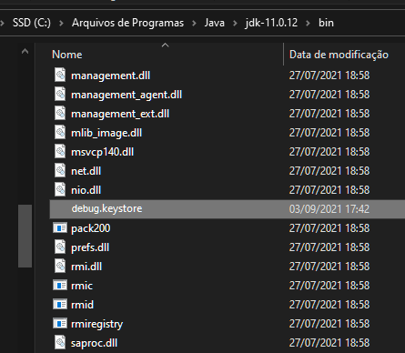

# Gerando Debug Key

-   Abra um terminal com keytool instalado
-   Navegue até a pasta ~/java/sdk/bin

    

-   Execute o comando abaixo

    ```
    keytool -genkey -v -keystore debug.keystore -storepass android -alias androiddebugkey -keypass android -keyalg RSA -keysize 2048 -validity 10000
    ```

    

-   Mova o arquivo para a pasta do App (myapp/android/app)

    
