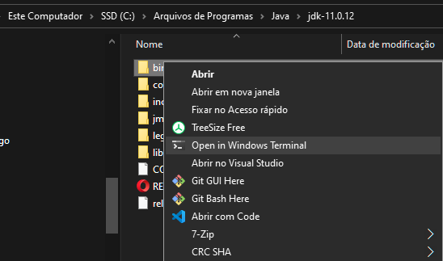
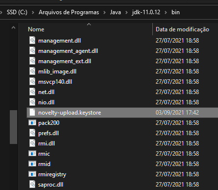
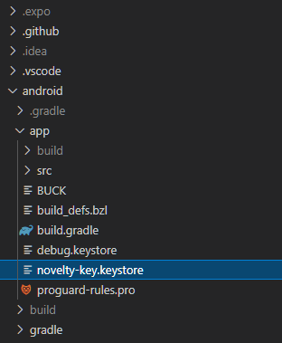
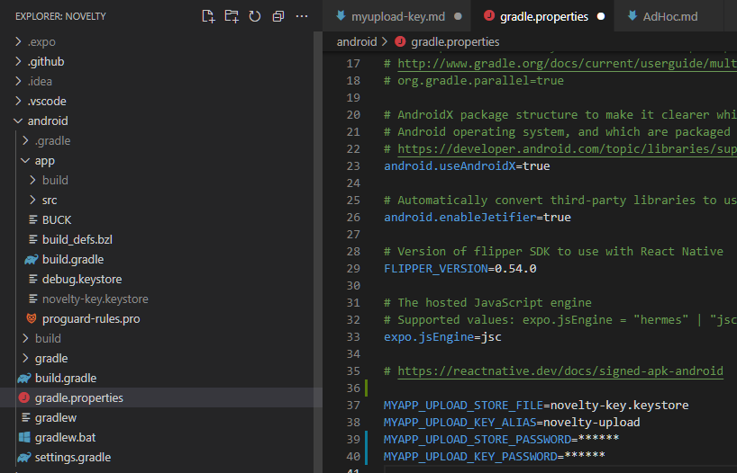

# Gerando uma Upload Key

O Android exige que todos os APKs sejam assinados digitalmente com um certificado antes de serem instalados em um dispositivo ou atualizados. Ao lançar usando Android App Bundles, é necessário assinar seu pacote de app com uma chave de upload antes de fazer upload dele para o Play Console, e a Assinatura de apps do Google Play cuida do resto. Para distribuição de apps com APKs na Play Store (criados antes de agosto de 2021) ou em outras lojas, é necessário assinar os APKs manualmente para upload.

## Windows

-   Você pode gerar uma chave de assinatura privada usando keytool. No Windows keytool deve ser executado no destino C:\Program Files\Java\jdkx.x.x_x\bin.

    

    ```
    keytool -genkeypair -v -storetype PKCS12 -keystore my-upload-key.keystore -alias my-key-alias -keyalg RSA -keysize 2048 -validity 10000
    ```

-   Este comando solicita senhas para o armazenamento de chaves e a chave e para os campos de Nome distinto para sua chave. Em seguida, ele gera o armazenamento de chaves como um arquivo chamado my-upload-key.keystore.

    

-   O armazenamento de chaves contém uma única chave, válida por 10.000 dias. O alias é um nome que você usará posteriormente ao assinar seu aplicativo, portanto, lembre-se de anotar o alias.

## Apple

-   No Mac, se você não tiver certeza de onde está a pasta bin JDK, execute o seguinte comando para localizá-la:

    ```
    /usr/libexec/java_home
    ```

-   Ele produzirá o diretório do JDK, que será semelhante a este:
    /Library/Java/JavaVirtualMachines/jdkX.X.X_XXX.jdk/Contents/Home

-   Navegue até esse diretório usando o comando cd /your/jdk/path e use o comando keytool com permissão sudo, conforme mostrado abaixo.

    ```
    sudo keytool -genkey -v -keystore my-upload-key.keystore -alias my-key-alias -keyalg RSA -keysize 2048 -validity 10000
    ```

# Configurando variáveis Gradle

-   Coloque o my-upload-key.keystorearquivo no android/app diretório da pasta do projeto.

    

-   Edite o arquivo ~/.gradle/gradle.properties ou android/gradle.propertie se adicione o seguinte (substitua **\*** pela senha do keystore, alias e senha da chave corretos)

    ```
    MYAPP_UPLOAD_STORE_FILE=my-upload-key.keystore
    MYAPP_UPLOAD_KEY_ALIAS=my-key-alias
    MYAPP_UPLOAD_STORE_PASSWORD=*****
    MYAPP_UPLOAD_KEY_PASSWORD=*****
    ```

    

-   Essas serão variáveis ​​globais do Gradle, que podemos usar posteriormente em nossa configuração do Gradle para assinar nosso aplicativo.

## Adicionando configuração de assinatura à configuração do Gradle do seu aplicativo

-   A última etapa de configuração que precisa ser feita é configurar os builds de liberação a serem assinados usando a chave de upload. Edite o arquivo android/app/build.gradle na pasta do projeto e adicione a configuração de assinatura

```
android {
    ...
    defaultConfig { ... }
    signingConfigs {
        release {
            if (project.hasProperty('MYAPP_UPLOAD_STORE_FILE')) {
                storeFile file(MYAPP_UPLOAD_STORE_FILE)
                storePassword MYAPP_UPLOAD_STORE_PASSWORD
                keyAlias MYAPP_UPLOAD_KEY_ALIAS
                keyPassword MYAPP_UPLOAD_KEY_PASSWORD
            }
        }
    }
    buildTypes {
        release {
            ...
            signingConfig signingConfigs.release
        }
    }
}
```

## Gerando a liberação AAB

Execute o seguinte em um terminal:

```
cd android
./gradlew bundleRelease
```

O Gradle agrupará no bundleReleasetodo todo o JavaScript necessário para executar seu aplicativo no AAB ( Android App Bundle).

> Nota: Certifique-se de que em gradle.properties não contem org.gradle.configureondemand=true pois isso fará com que a versão de lançamento ignore o empacotamento de JS e ativos no binário do aplicativo.

O AAB gerado pode ser encontrado em android/app/build/outputs/bundle/release/app.aab e está pronto para ser carregado no Google Play.

## Testando a versão de lançamento do seu aplicativo

Antes de enviar a versão de lançamento para a Play Store, certifique-se de testá-la completamente. Primeiro desinstale qualquer versão anterior do aplicativo que você já instalou. Instale-o no dispositivo usando o seguinte comando na raiz do projeto:

```
npx react-native run-android --variant=release
```

Observe que --variant release só está disponível se você configurou a assinatura conforme descrito acima.

Você pode encerrar qualquer instância do bundler em execução, uma vez que toda a sua estrutura e código JavaScript são agrupados nos ativos do APK.
