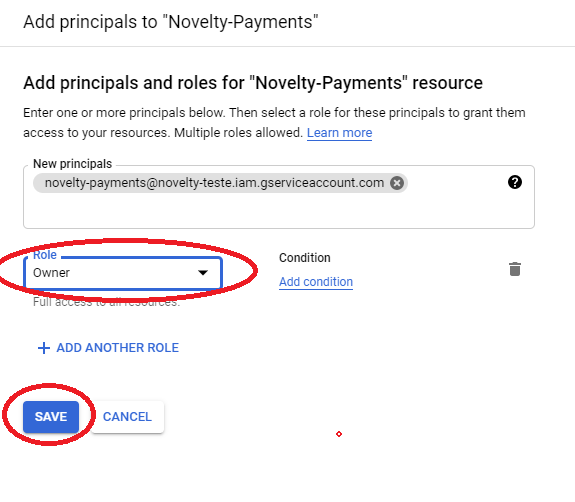

# Criar e configurar conta de Serviço no Google Cloud

-   Abra o menu de contas de serviço clicando [aqui](https://console.cloud.google.com/projectselector2/iam-admin/serviceaccounts?supportedpurview=project)

    

-   Selecione o projeto do App

    

-   Clique em Create Service Account

    

-   Preencha o nome e a descrição, clique em Done.

    

-   Clique em Menage Keys

    

-   Clique em Create new Key

    

-   Selecione JSON e clique em Create.

    

-   O download do JSON com os dados da conta começa automaticamente

    

-   Copie o 'Client Email' dentro do Json, clique em Permissions > Grant Access

    

-   Cole o Email na aba New Principals, selecione Owner na aba 'Role' e clique em Save.

    

-   Habilite a Api do Google Play Android

    
