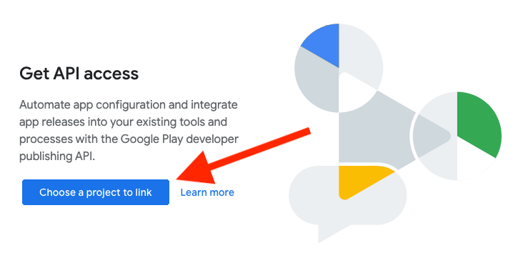
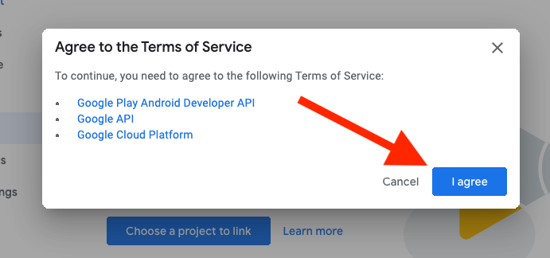
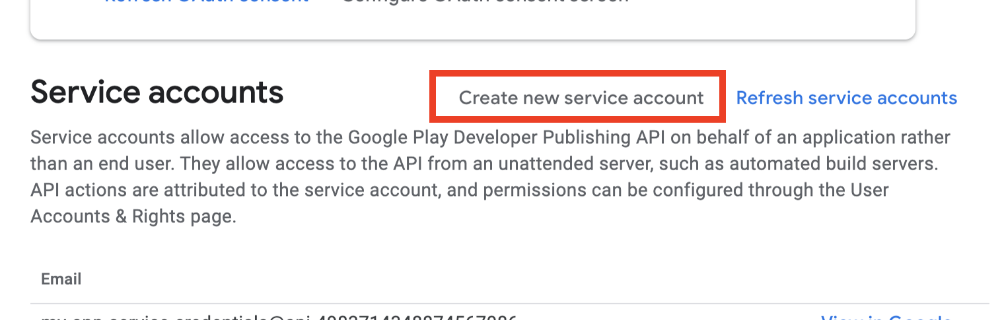
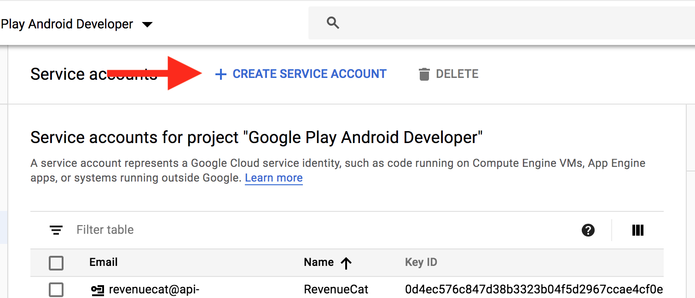
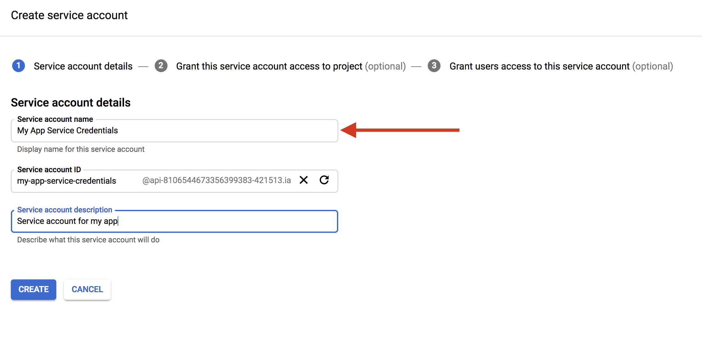
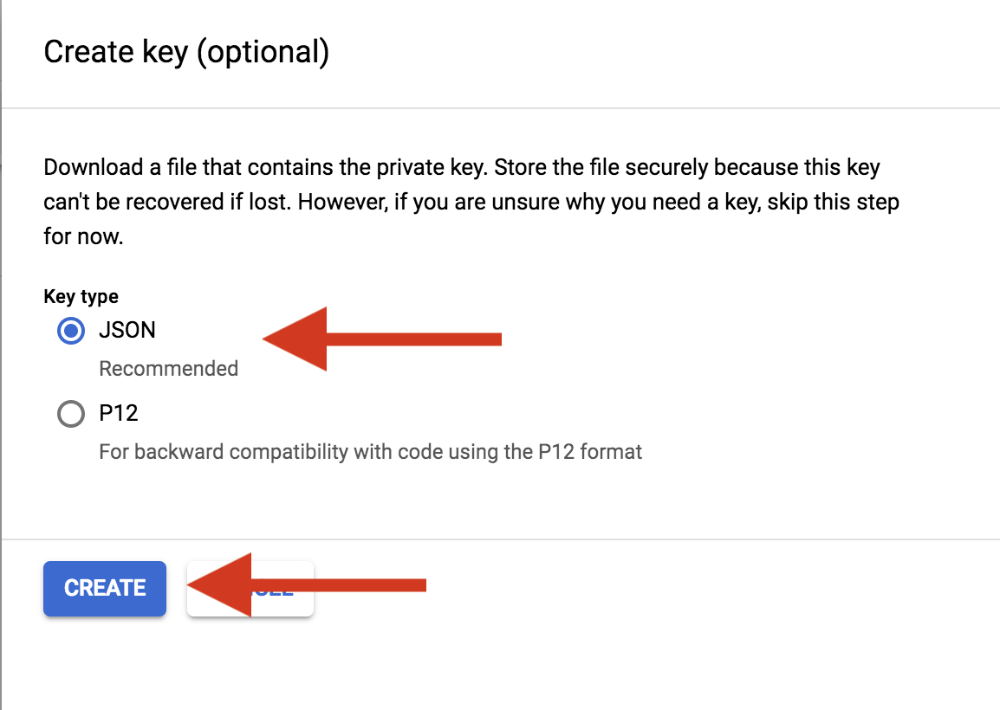
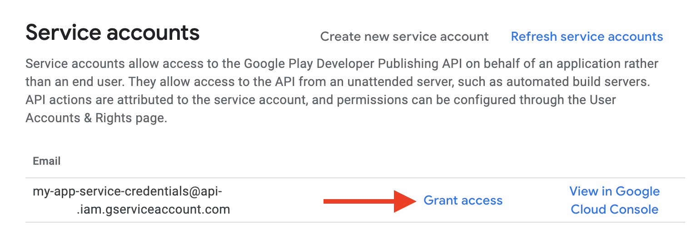
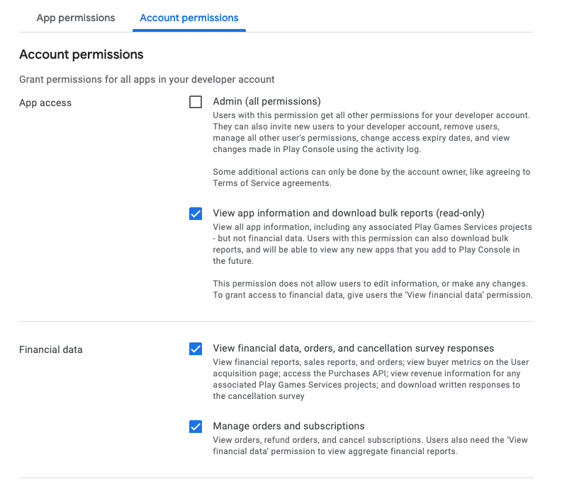

# Criar e configurar conta de Serviço

-   Abra os menus Configurações> Conta do desenvolvedor e selecione acesso à API ou clique [aqui](https://play.google.com/console/u/0/developers/5134206708863937345/api-access)

    

    -   Selecione Link para conectar sua conta do Play a um projeto de desenvolvedor do Google

    

    -   Concordo com os termos e condições

    

-   Criar conta de serviço Em seguida, precisamos criar uma conta de serviço. Isso é feito no console de API do Google.

    -   Selecione Criar conta de serviço

    

    -   Criar credenciais de chave de conta de serviço

    

    -   Insira os detalhes da conta de serviço

    

    -   Baixe sua credencial JSON: json-credentials

    

-   Conceda acesso

    -   No Play Console, selecione Conceder acesso na conta de serviço recém-criada

    

    -   Conceda as seguintes permissões:

    

    > Nota: Depois disso, aguarde 48 horas para permitir que o Google propague todos os direitos de acesso para APIs.
