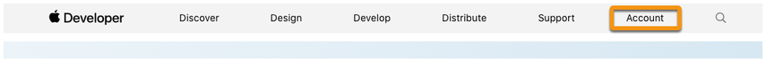
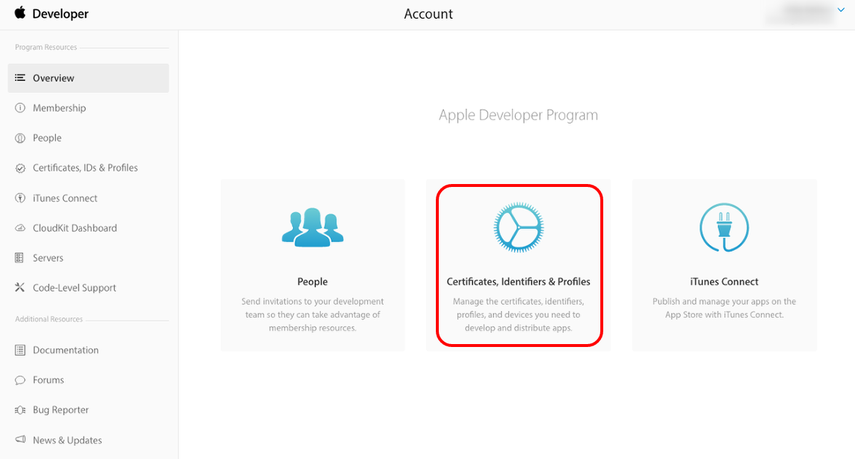
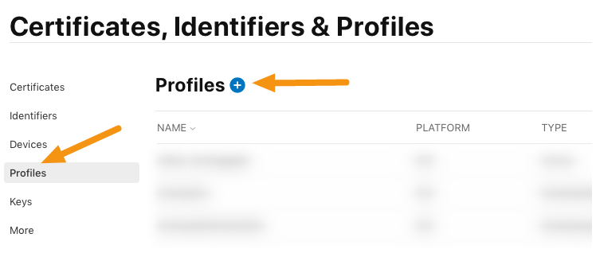
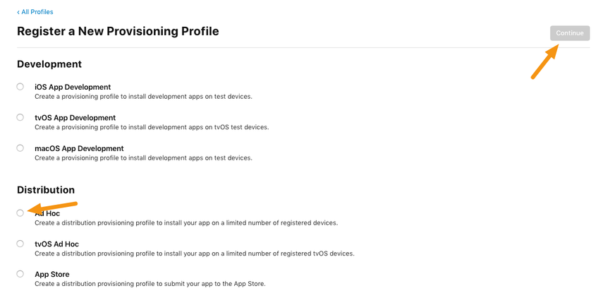
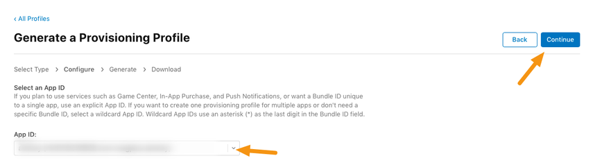
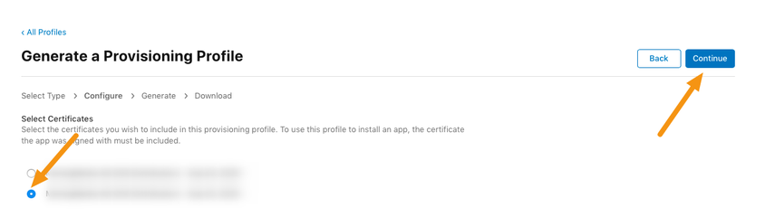
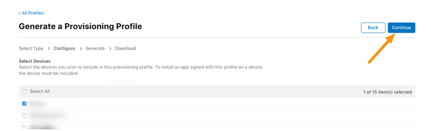
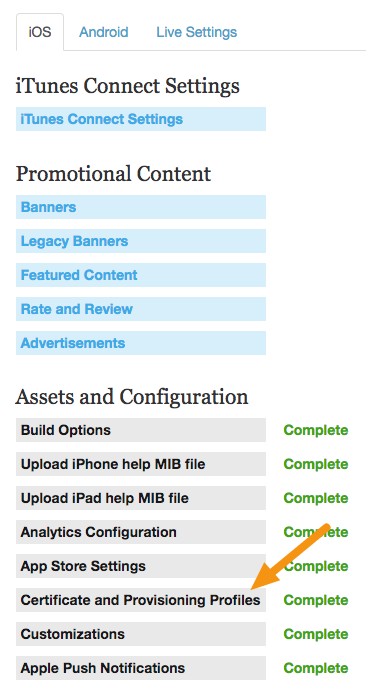
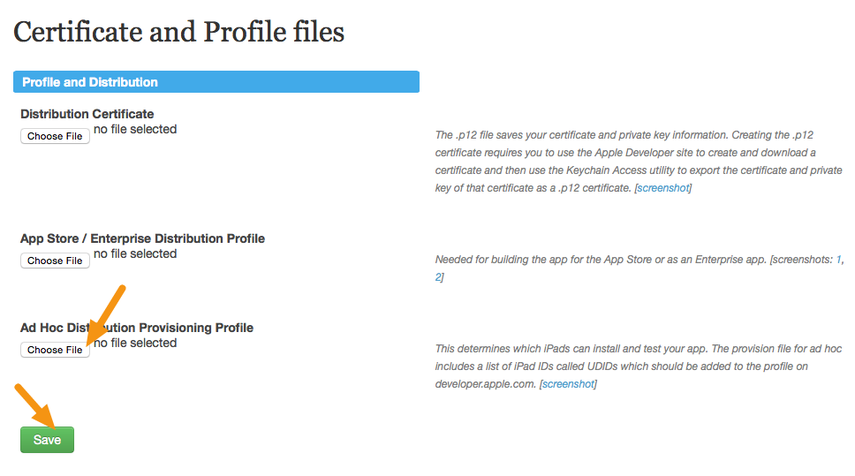

# Criando um Mobileprovision de Distribuição Ad Hoc

Um Perfil de Provisionamento de Distribuição combina seu App ID e Certificado de Distribuição. Ele autoriza seu aplicativo a usar serviços específicos (como notificações push) e garante que seu aplicativo seja enviado por você. É por isso que os certificados de distribuição estão vinculados a um Mac específico.

Um Perfil de Provisionamento de Distribuição Ad Hoc permite que você teste seus aplicativos integrados em dispositivos que você configurou no AppStore Connect. Este artigo o ajudará a criar um perfil de distribuição para testar seu aplicativo em dispositivos iOS antes de enviá-lo para a Apple App Store.

> Nota: Os dispositivos de teste em um perfil Ad Hoc são diferentes dos dispositivos de teste definidos no portal mag + Publish. Dispositivos de teste em um perfil Ad Hoc permitem que você teste seu aplicativo em dispositivos selecionados antes de torná-lo ativo. Dispositivos de teste na mag + permitem que você teste o conteúdo do portal mag + Publish antes de ser publicado.

-   Verifique antes de você começar

    -   Certifique-se de ter criado um ID de aplicativo no AppStore Connect
    -   Certifique-se de ter criado e instalado seu Certificado de Distribuição como um arquivo p12
    -   Certifique-se de ter adicionado todos os seus dispositivos de teste iOS no iOS Dev Center

## Como criar um perfil de provisionamento de distribuição ad hoc

-   Para fazer login no iOS Developer Console, vá para <https://developer.apple.com> e clique em Conta na parte superior

    

    Clique em "Certificados, identificadores e perfis".

    

-   Clique em "Todos" na seção "Perfis de provisionamento"

    

-   Clique no botão "+" para adicionar um novo perfil.

-   Clique no botão de opção próximo a "Ad Hoc" e, em seguida, clique em "Continuar".

    

-   No menu pop-up, escolha um ID de aplicativo para associar ao seu aplicativo e clique em "Continuar".
    

-   Clique no botão de rádio próximo ao seu Certificado de Distribuição e clique em "Continuar".

    

-   Coloque uma marca de seleção ao lado dos dispositivos de teste onde você instalará seu aplicativo e clique em "Continuar".

    > Nota: Seu aplicativo só funcionará nos dispositivos que você verificar. Sempre que adicionar ou remover um dispositivo, você precisará gerar um novo perfil Ad Hoc.

    

-   Digite o nome do seu aplicativo e "-AdHoc" no campo do nome e clique em "Gerar".

    

-   Clique no botão "Download" para baixar seu perfil de distribuição Ad Hoc.

-   Faça login no portal mag + Publish <https://publish.magplus.com> e vá para Apps> iOS> Certificado e Arquivos de Provisionamento.

    

-   Clique em "Escolher arquivo" sob o título Ad Hoc, selecione o perfil que você criou anteriormente e clique em "Salvar".

    
