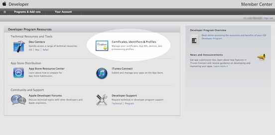
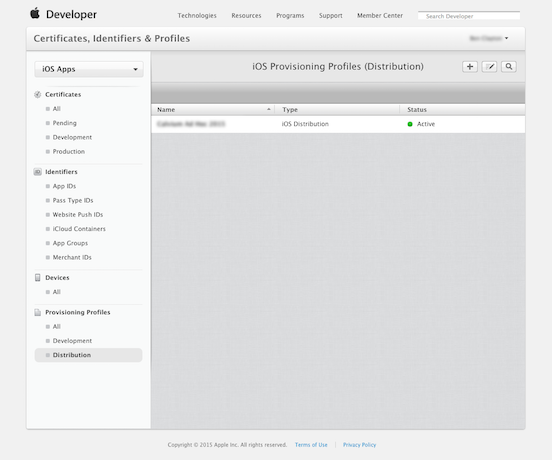
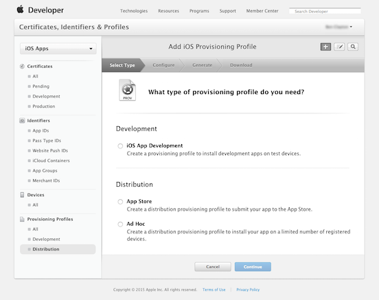
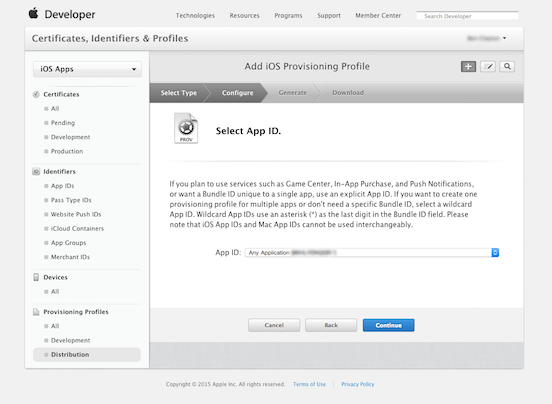
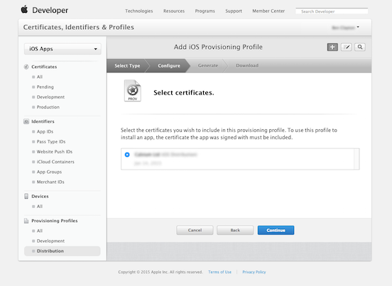
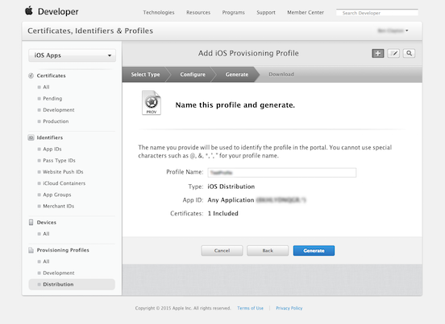
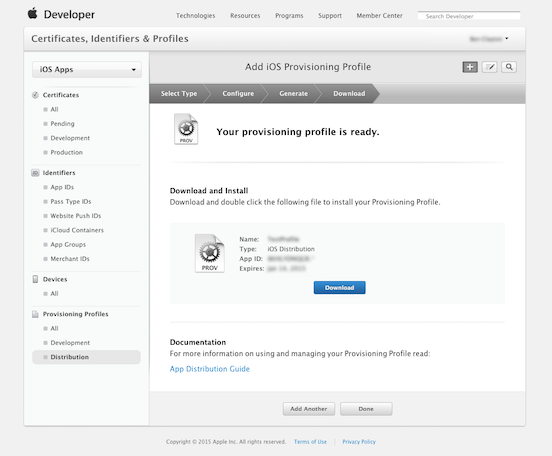

# Criando um Mobileprovision de Distribuição AppStore

Para publicar seu aplicativo na Apple App Store, você precisa saber como fazer um arquivo mobileprovision. Depois de criar um arquivo p12 , siga este guia para criar um arquivo mobileprovision.

-   Requisitos
    -   Uma conta de desenvolvedor Apple iOS (https://developer.apple.com/devcenter/ios/index.action)

# O processo

-   Faça login em https://developer.apple.com

-   Clique em “Certificates, Identifiers & Profiles”

    

-   Clique em “Provisioning Profiles” na coluna da esquerda

    

-   Em ““Provisioning Profiles” (painel inferior esquerdo), clique em “Distribution”

    

-   Clique no botão “Add” (+) no canto superior direito do painel principal

-   Selecione “App Store”

    

-   Clique em Continuar

-   Selecione o ID do aplicativo referente n dropdown

    

-   Clique em Continuar

-   Selecione o certificado para assinar (você pode ter apenas uma opção)

    

-   Clique em Continuar

-   Dê ao seu perfil um nome relevante (por exemplo, “Nome do aplicativo, ano”)

    

-   Clique em Download para salvar seu arquivo de provisão

    

-   Clique em Concluído quando o download for concluído

> Agora você tem um arquivo mobileprovision, permitindo enviar seu aplicativo para a iOS App Store.
