# Criação de um certificado de distribuição e arquivo .p12

Um certificado de distribuição identifica sua equipe / organização em um perfil de provisionamento de distribuição e permite que você envie seu aplicativo para a Apple App Store.

Um arquivo .p12 contém os certificados de que a Apple precisa para construir e publicar aplicativos.

As etapas abaixo irão guiá-lo através do processo de criação de um certificado de distribuição iOS e um arquivo .p12. Para ler mais sobre certificados e como eles funcionam na App Store da Apple, visite o [iOS Dev Center](https://developer.apple.com/devcenter/ios/) e consulte a documentação oficial da Apple.

Nota: Essas etapas devem ser realizadas em um Mac que você usará para enviar e publicar seus aplicativos na Apple App Store. Embora você possa transferir o acesso para outro computador Mac, recomendamos seguir essas etapas na máquina real que você usará para enviar aplicativos.

Antes de você começar

Identifique qual Mac você usará para enviar aplicativos para a Apple App Store
Certifique-se de se inscrever para uma conta de desenvolvedor iOS
Certifique-se de ter criado um ID de aplicativo no iTunes Connect (para obter mais informações, leia o artigo [iOS - Creating an App ID](https://support.magplus.com/entries/20813792) )

## Como criar um certificado de distribuição

-   No Mac, vá para a pasta Aplicativos> Utilitários e abra Acesso às Chaves.

-   No Mac, vá para a pasta Aplicativos> Utilitários e abra Acesso às Chaves.

    

-   Vá para Keychain Access> Certificate Assistant> Request a Certificate from a Certificate Authority.

    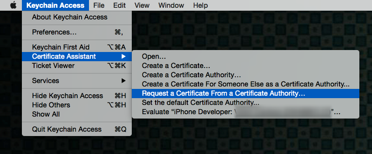

-   Preencha as informações na janela Informações do certificado conforme especificado abaixo e clique em "Continuar".

    -   No campo Endereço de e-mail do usuário , insira o endereço de e-mail para se identificar com este certificado

    -   No campo Nome comum , digite seu nome

    -   No grupo Solicitar , clique na opção "Salvo no disco"

    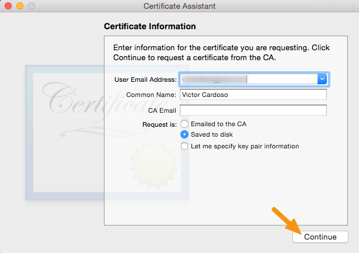

*   Salve o arquivo em seu disco rígido.

    -   O assistente cria um arquivo de Solicitação de Assinatura de Certificado (CSR) que contém um par de chaves pública / privada.

    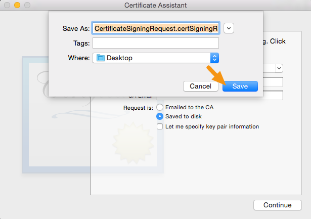

*   Para fazer login no iOS Developer Console e clique em Conta na parte superior
    
*   Clique em "Certificados, identificadores e perfis".

    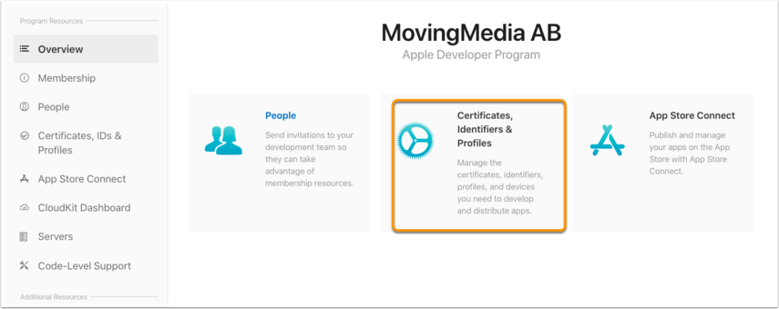

*   Vá para Certificados e clique no botão "+" para adicionar um novo certificado.
    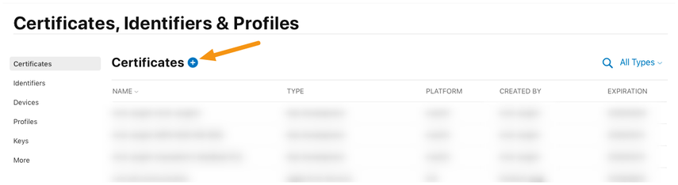
*   Selecione "App Store e Ad Hoc" nas opções de produção e clique em "Continuar".

    > Nota: Para usar seus certificados, você deve ter o 'intermediate signing certificate' em seu sistema OS X keychain. Isso é instalado automaticamente pelo Xcode.

    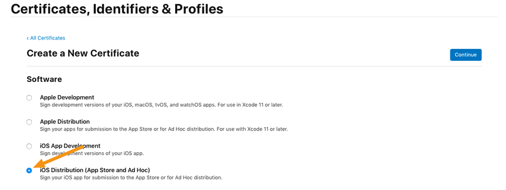

*   Clique em "Continuar" novamente.

    -   Você criou seu arquivo CSR nas etapas anteriores, portanto, não há necessidade de criar outro.

    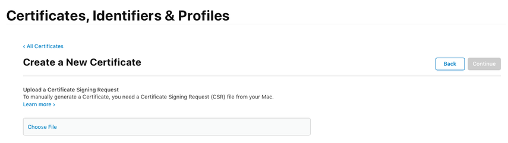

*   Clique em "Escolher arquivo" e selecione o arquivo CSR criado anteriormente e clique em "Continuar".
    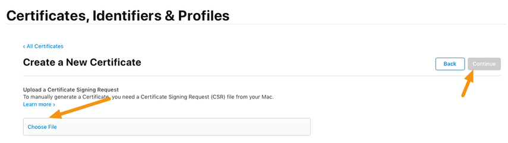
*   Clique no botão "Download" para baixar um arquivo .cer para a sua máquina e clique em "Concluído".
    
*   Clique duas vezes no arquivo .cer para instalá-lo no Keychain Access.

    -   Ele terá o nome de "iPhone Distribution <firstname> <lastname>" e expirará um ano a partir da data de hoje.
        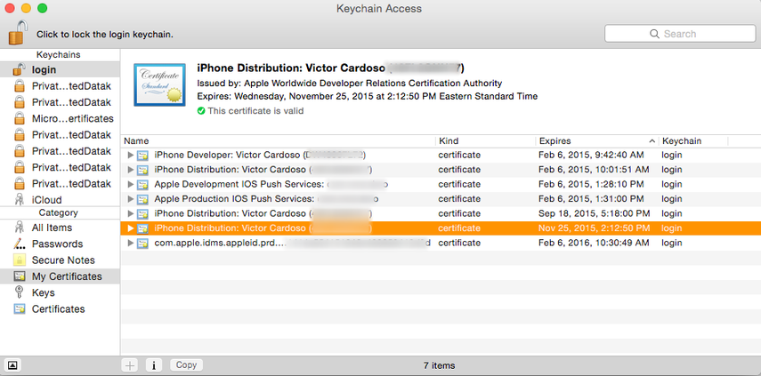

    -   Ele terá o nome de "iPhone Distribution <firstname> <lastname>" e expirará um ano a partir da data de hoje.
        

## Como exportar um certificado de distribuição como um arquivo .p12

Um arquivo .p12 é um arquivo especialmente formatado e criptografado que contém seu certificado de distribuição. É incorporado pelo portal de publicação mag + ao construir seu aplicativo. O iTunes Connect verifica esse arquivo quando você envia um aplicativo e só o aceitará se ele contiver um arquivo .p12 que corresponda ao que você configurou em sua conta do iTunes Connect.

-   No Mac, inicie o Keychain Access, selecione a entrada do certificado e clique com o botão direito do mouse para selecionar "Exportar".

    -   Todos os certificados que você instalou estarão no chaveiro de "login" (Etiqueta 1) na categoria "Meus certificados" (Etiqueta 2).

    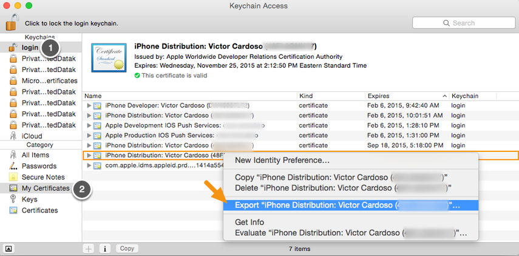

-   Na janela que aparece, certifique-se de que o Formato do Arquivo esteja definido como "Troca de Informações Pessoais (.p12)" e clique em "Salvar" para salvá-lo em sua máquina.

    

-   Quando for solicitada uma senha, deixe em branco e clique em "Ok".

    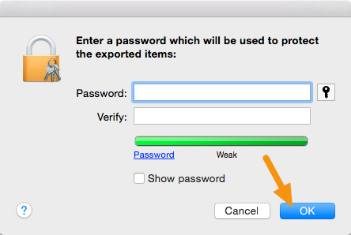

-   Quando for solicitada a senha do computador, digite-a e clique em "Permitir".

    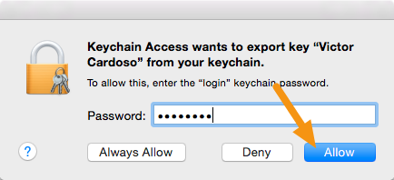

-   Seu arquivo .p12 será salvo no local que você especificou.

    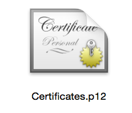

-   Faça login no portal mag + Publish e vá para Apps> iOS> Certificate and Provisioning Files.
    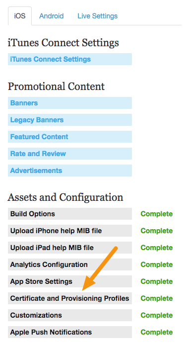

7. Clique em "Escolher arquivo" sob o título Certificado de distribuição, selecione seu certificado de distribuição e clique em "Salvar".
   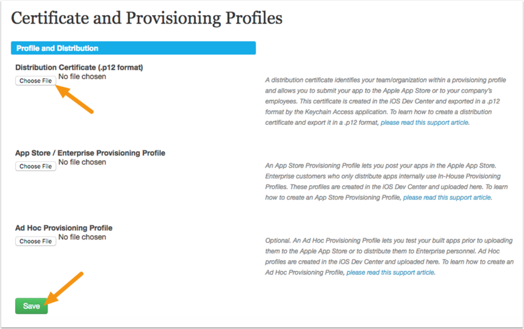
