# Criação das chaves e configuração do login com Facebook

-   Crie seu aplicativo clicando nesse link [Facebook Console Create App](https://developers.facebook.com/apps/create/)
-   Selecione o Tipo de Aplicativo e avance para a proxima tela

    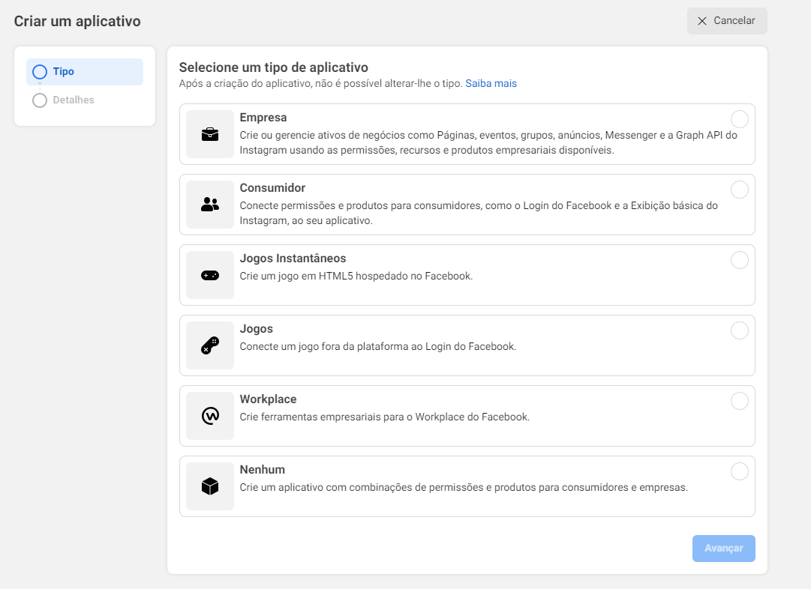

-   Escolha o nome e se necessário preencha os dados, clique em Criar Aplicativo

    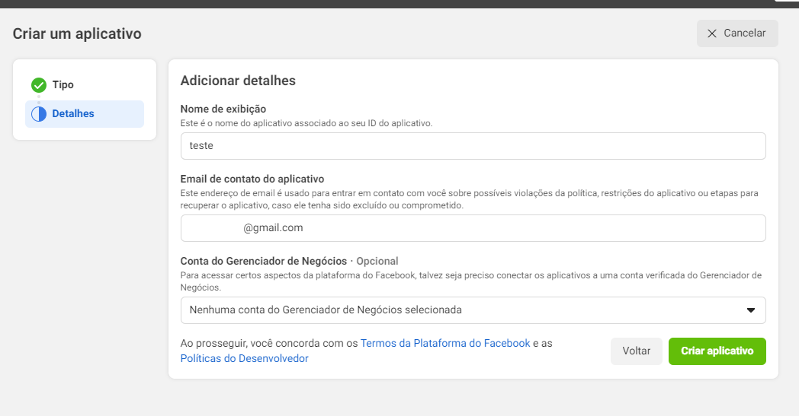

-   Com o aplicativo criado, já na tela inicial do App, clique para configurar o Login do Facebook.

    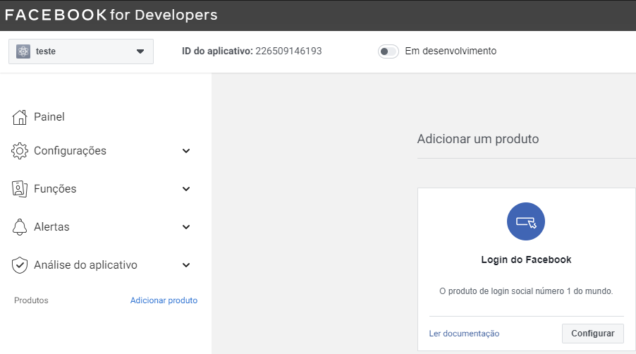

-   Depois de clicar, abrirá uma aba para as configurações do Login abaixo, clique em configurações

    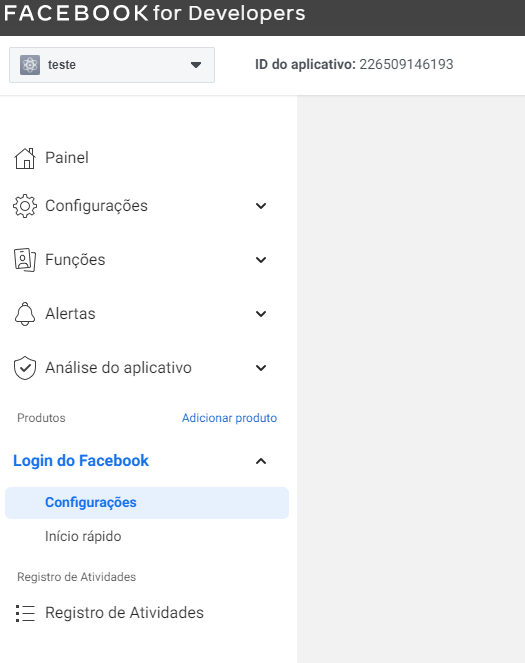

-   Nessa tela precisamos adicionar o URI de redirecionamento conforme o Expo auxilia (https://auth.expo.io/@seunomenofacebook/nomedoapp), apois adicionar, salve as alterações. [Referencia](https://docs.expo.dev/guides/authentication/#facebook)

    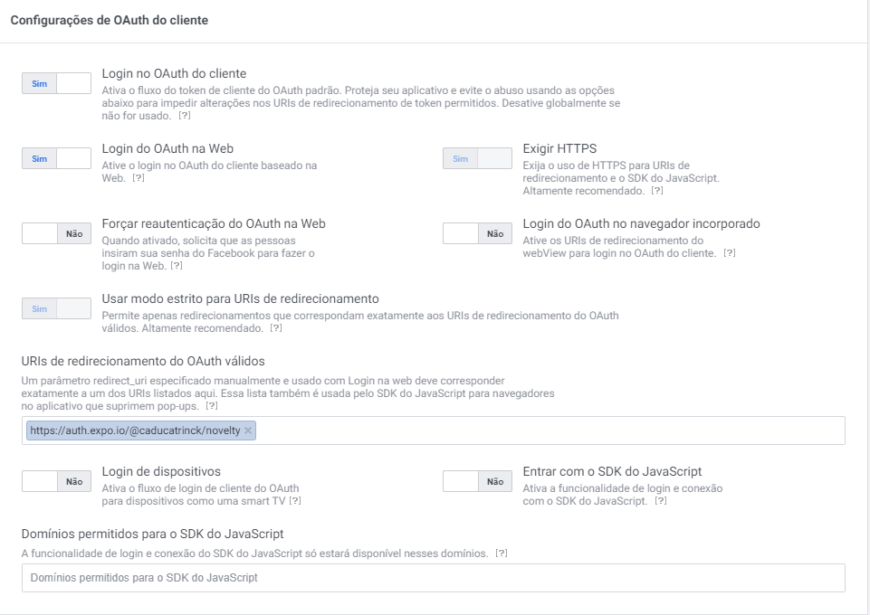

-   Agora clique em Configurações, Básico.

    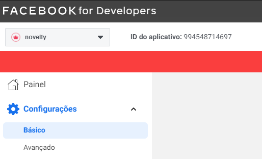

-   Aqui estão dois dados que precisamos guardar o ID do aplicativo, e a Secret Key

    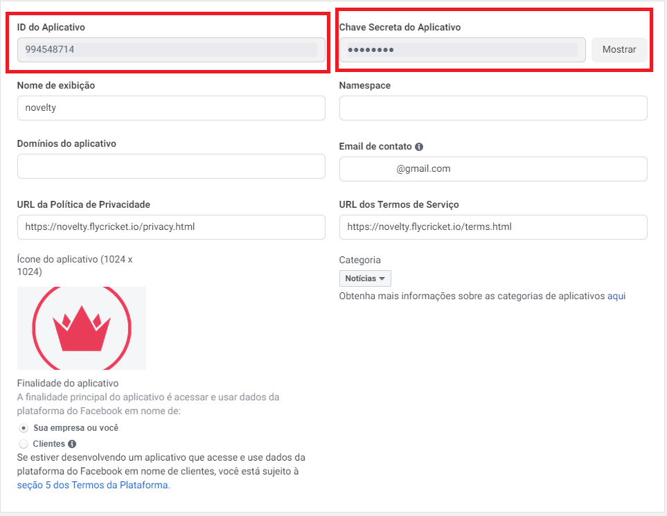

-   Desce na Página e clique em Adicionar Plataforma.

    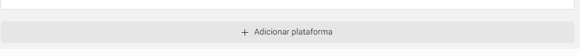

-   Primeiro vamos configurar o Android, depois de selecionar, clique em avançar.

    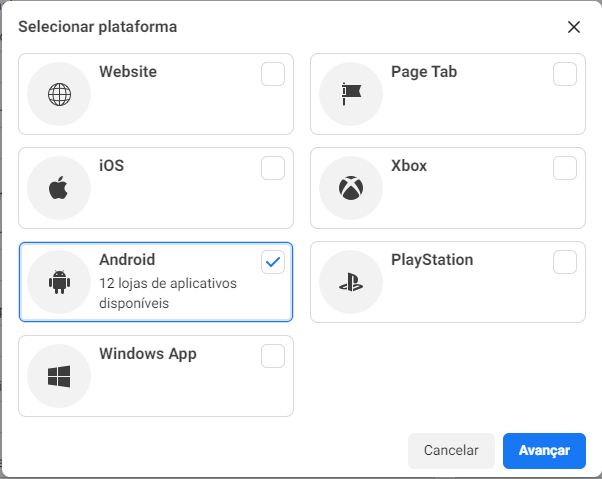

-   Selecione Google Play, clique em Next

    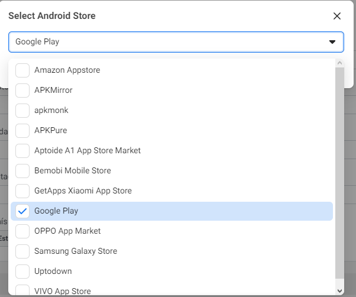

-   Adicione os dados como na imagem e salve as alterações

    -   Package Name é o nome do pacote configurado dentro do arquivo (android/app/src/main/AndroidManifest.xml)

    -   A Key Hash é o Hex da SHA-1 convertido pra base64, voce vai precisar da SHA-1 de upload e da SHA-1 da play store! (a sha-1 de debug é opicional)[Conversor Hex to Base64](http://tomeko.net/online_tools/hex_to_base64.php)

    -   Como criar a key (SHA-1) [Tutorial SHA-1](https://github.com/luanmuniz/novelty-app/blob/v5/documents/Android/MyUploadKey/myupload-key.md)

    -   Adquira o codigo SHA-1 do [Play Console](https://play.google.com/console/u/0/developers/5134206708863937345/app/4975441594755808703/keymanagement), na tela inicial clique no seu App, na barra lateral, clique em Setup > App Integrity

    -   Adquira o codigo SHA-1 da sua Debug e Upload-Key utilizando o comando abaixo:

    ```
    keytool -list -v -keystore {keystore_name} -alias {alias_name}
    ```

    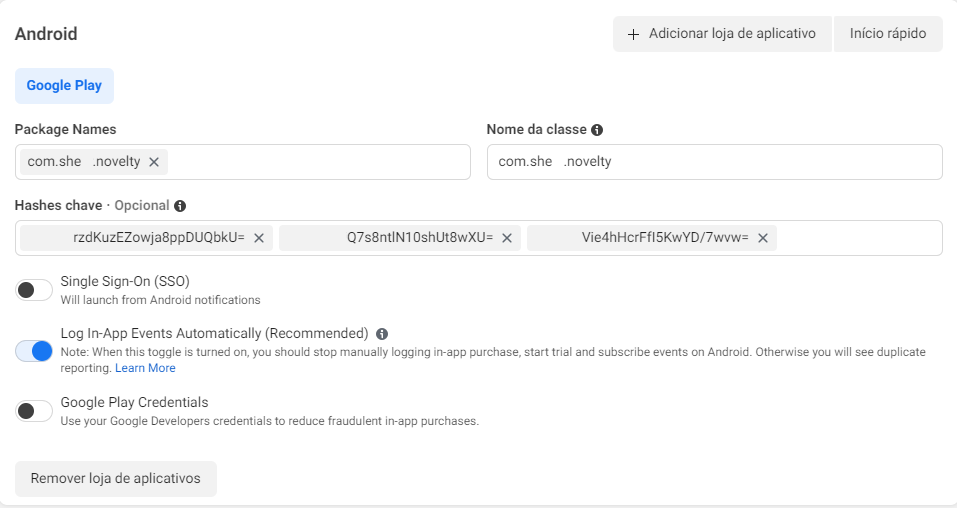

-   Agora vamos configurar o IOS, na tela configuração clique novamente em Adicionar Plataforma, mas dessa vez escolha IOS, configure como na imagem e salve as alterações

    >     O id do pacote é como mostra o nome o BundleIdentifier ao abrir o aplicativo no Xcode
    >     O Sufixo de esquema é o ID do aplicativo no Facebook com as letras fb na frente

    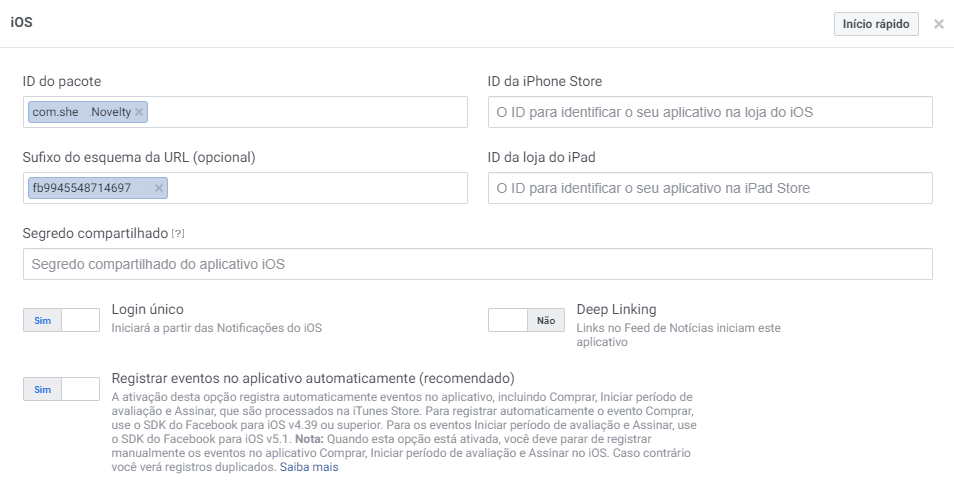

-   Por ultimo, clique em 'em desenvolvimento' como na imagem
    >     Para isso você vai precisar de uma serie de configurações como politica de privacidade e regras para usuários.
    >
    > 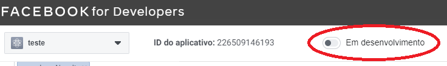

# Configurando Ambiente para Login na Apple

-   Clique com o botão direito do mouse em Info.plist e selecione Abrir como ▸ Código-fonte.

-   Copie e cole o seguinte trecho em XML no corpo do arquivo (<dict>...</dict>).

        <key>CFBundleURLTypes</key>
        <array>
        	<dict>
        	<key>CFBundleURLSchemes</key>
        	<array>
        		<string>fbAPP-ID</string>
        	</array>
        	</dict>
        </array>
        <key>FacebookAppID</key>
        <string>APP-ID</string>
        <key>FacebookClientToken</key>
        <string>CLIENT-TOKEN</string>
        <key>FacebookDisplayName</key>
        <string>APP-NAME</string>

-   Em <array><string>, na chave [CFBundleURLSchemes], substitua APP-ID pelo ID do aplicativo com fb na frente.

-   Em <string>, na chave FacebookAppID, substitua APP-ID pelo ID do aplicativo.

-   Em <string>, na chave FacebookClientToken, substitua CLIENT-TOKEN pelo valor encontrado em Configurações > Avançado > Token de cliente no Painel de Aplicativos.

-   Em <string>, na chave FacebookDisplayName, substitua APP-NAME pelo nome do aplicativo.
    Para usar um diálogo do Facebook (por exemplo, o diálogo Entrar, de compartilhamento, de convites para o aplicativo e assim por diante) que possa executar uma mudança de aplicativo do Facebook, o Info.plist do aplicativo precisará incluir também <dict>...</dict>).

        <key>LSApplicationQueriesSchemes</key>
        <array>
        	<string>fbapi</string>
        	<string>fbapi20130214</string>
        	<string>fbapi20130410</string>
        	<string>fbapi20130702</string>
        	<string>fbapi20131010</string>
        	<string>fbapi20131219</string>
        	<string>fbapi20140410</string>
        	<string>fbapi20140116</string>
        	<string>fbapi20150313</string>
        	<string>fbapi20150629</string>
        	<string>fbapi20160328</string>
        	<string>fbauth</string>
        	<string>fb-messenger-share-api</string>
        	<string>fbauth2</string>
        	<string>fbshareextension</string>
        </array>

-   Configurar app.json
    -   dentro do app.json e dentro do objeto expo, adicione:
    ```
    "facebookAppId": "9945548714697",
    "facebookDisplayName": "Novelty",
    "facebookScheme": "fb9945548714697",
    ```
-   Por fim, ficará assim

    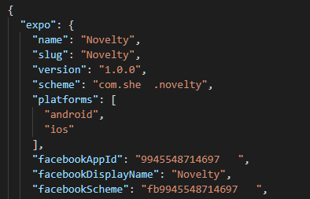
