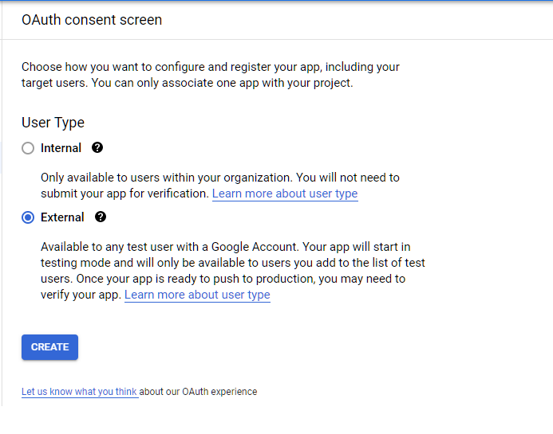
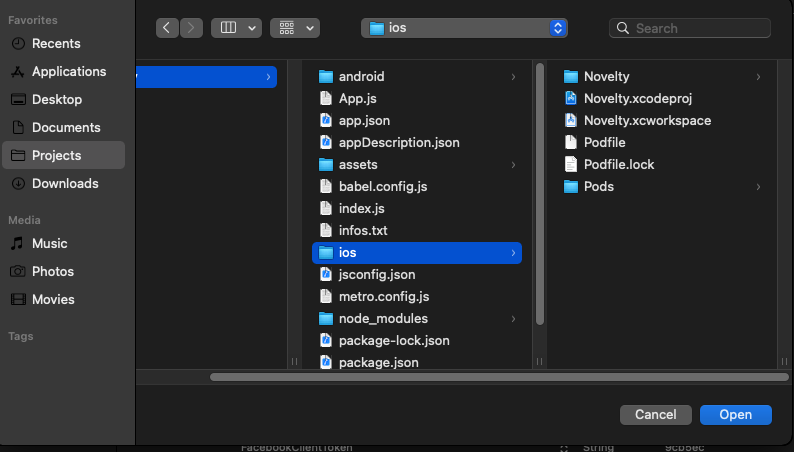

# Obtenha seu ID de cliente da API do Google

-   Para criar seu WebClientId com o Google em seu site, primeiro você precisa configurar seu app na API do Google. Para fazer isso, conclua as seguintes etapas:

    -   Crie e seu aplicativo no [Google Cloud Platform](http://console.cloud.google.com/projectcreate)

        

    -   Abra a página Credenciais do console de APIs do Google e certifique-se que seu APP está selecionado ao lado do nome Platform.

        

    -   Clique em Create Credentials e selecione OAuth client ID.

        

    -   Caso ainda não tenha configurado sua Consent Screen, essa tela aparecera, clique em Configure Consent Screen.

        

    -   Na próxima tela clique em external (a não ser que voce queira testar dentro de um time de devs), depois Create.

        

    -   Adicione os dados do seu App (Apenas o necessário), avance de acordo com o que for preenchendo do passo 1 ao 4.

        

    -   Depois de informar os dados do App, na ultima parte clique em Back to Dashboard.

        

    -   Agora com tudo configurado, abra novamente a pagina de credenciais e clique em Create Credentials depois OAuth client ID.

        

    -   Selecione com o que precisa trabalhar (Web/Android/IOS) o login com o Expo utiliza o Web Application e o IOS.

        

    -   Dê um nome para seu OAuth ClientID e clique em Create

        

    -   Pronto! seu OAuth ClientID foi criado, esse deve ser a tela com os dados para copia-lo e utilizar em seu App.

        

    -   Observação: você precisa da string de ID do cliente exibida no console para configurar o Login com o Google e verificar os tokens de ID em seu back-end. Um ID de cliente se parece com o seguinte exemplo:

    1234567890-abc123def.apps.googleusercontent.com

    ## Configurando na nossa Máquina

    -   O ID do cliente invertido é o seu ID do cliente com a ordem dos campos delimitados por pontos invertida. Por exemplo:

        ```
        com.googleusercontent.apps.1234567890-abcdefg
        ```

    -   Adicione as sequintes linhas no app.json

        ```
        "ios": {
          "bundleIdentifier": "com.she.novelty",
          "config": {
        	"googleSignIn": {
        	  "reservedClientId": "com.googleusercontent.apps.310201-uldiokb4tdauaeumv2pghssgsnjmp"
        	}
          }
        },
        "android": {
          "package": "com.she.novelty"
        },
        ```

        

    -   Adicionando o Reversed Client ID na URL Scheme da info.plist

    -   Abra o Xcode, clique em File > Open

        

    -   Abra a pasta do projeto, depois abra a pasta IOS, SÓ DEPOIS, clique em open

        

    -   Com o App aberto no Xcode, clique em Novelty com o icone azul, logo abaixo dos botoes do menu, depois clique em Info, abra URL types.

        

    -   Logo abaixo clique no icone de Add (+) e configure os dados do Schema

        >     Identifier é o Bundle Identify do App

        >     URL Schemes é o reversed Client ID do google.

        
